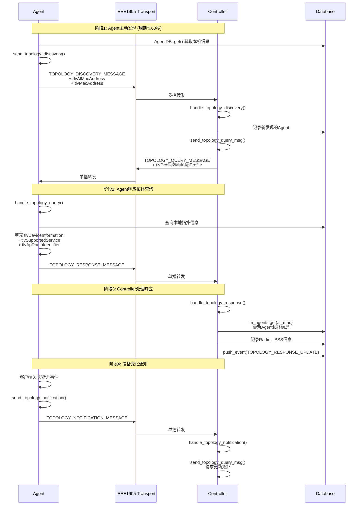
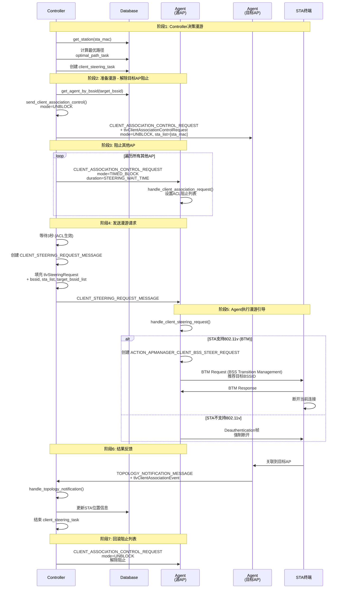

# prplMesh 代码框架与核心流程详解

## 目录

1. [代码架构总览](#一代码架构总览)
2. [分层架构详解](#二分层架构详解)
3. [核心场景流程分析](#三核心场景流程分析)
4. [关键设计模式](#四关键设计模式)
5. [代码导航指南](#五代码导航指南)

---

## 一、代码架构总览

### 1.1 项目目录结构

```
prplMesh/
├── controller/                 # Controller 端实现
│   ├── src/beerocks/
│   │   ├── master/            # 主控制逻辑
│   │   │   ├── master_thread.cpp      # 主线程入口
│   │   │   ├── son_actions.cpp        # SON 动作实现
│   │   │   └── tasks/                 # 任务模块
│   │   │       ├── topology_task.cpp          # 拓扑管理
│   │   │       ├── ap_configuration_task.cpp  # AP配置
│   │   │       ├── client_steering_task.cpp   # 客户端漫游
│   │   │       ├── channel_selection_task.cpp # 信道选择
│   │   │       └── agent_monitoring_task.cpp  # Agent监控
│   │   ├── cli/               # 命令行接口
│   │   ├── bml/               # BML 接口
│   │   └── prplmesh-cli/      # prplmesh CLI工具
│   └── config/                # Controller 配置
│
├── agent/                     # Agent 端实现
│   ├── src/beerocks/
│   │   ├── slave/             # 从节点逻辑
│   │   │   ├── son_slave_thread.cpp    # Agent 主线程
│   │   │   ├── tasks/
│   │   │   │   ├── topology_task.cpp           # 拓扑发现
│   │   │   │   ├── ap_autoconfiguration_task.cpp # AP自动配置
│   │   │   │   ├── channel_selection_task.cpp  # 信道选择
│   │   │   │   └── controller_connectivity_task.cpp # Controller连接
│   │   │   └── backhaul_manager/
│   │   │       └── backhaul_manager.cpp  # 回程管理(FSM)
│   │   └── fronthaul_manager/ # 前传管理
│   └── config/                # Agent 配置
│
├── framework/                 # 框架层（基础设施）
│   ├── common/               # 公共工具
│   │   ├── logger.cpp        # 日志系统
│   │   ├── utils.cpp         # 工具函数
│   │   └── encryption.cpp    # 加密工具
│   ├── transport/            # 传输层
│   │   └── ieee1905_transport/  # IEEE 1905.1 传输
│   ├── tlvf/                 # TLV 编解码框架
│   │   ├── tlvf.py           # TLV 代码生成器
│   │   ├── yaml/tlvf/        # TLV 定义(YAML)
│   │   └── AutoGenerated/    # 自动生成的TLV代码
│   ├── platform/             # 平台抽象层
│   │   ├── bpl/              # 平台抽象接口
│   │   ├── nbapi/            # North Bound API
│   │   └── wbapi/            # West Bound API
│   └── external/             # 外部依赖
│       └── easylogging/      # 日志库
│
├── common/                    # 公共代码
│   └── beerocks/
│       ├── bcl/              # 公共库
│       ├── btl/              # 传输层抽象
│       ├── bwl/              # 无线抽象层
│       ├── hostapd/          # Hostapd 接口
│       └── tlvf/             # TLV 公共定义
│
├── tests/                     # 测试代码
│   ├── certification/        # 认证测试
│   └── boardfarm_plugins/    # Boardfarm 插件
│
└── ci/                        # CI/CD 配置
    └── certification/        # 认证脚本
        ├── R1/               # R1 认证
        ├── R4/               # R4 认证
        └── R6/               # R6 认证
```

### 1.2 架构分层图

```
┌─────────────────────────────────────────────────────────────────────────────┐
│                              应用层 (Application)                           │
│  ┌─────────────────────────────────────────────────────────────────────────┐│
│  │                         Controller (主控制器)                           ││
│  │  ┌──────────────┐ ┌──────────────┐ ┌──────────────┐ ┌──────────────┐  ││
│  │  │ 拓扑管理     │ │ AP配置管理   │ │ 漫游决策     │ │ 信道优化     │  ││
│  │  │topology_task │ │ap_config_task│ │steering_task │ │channel_task  │  ││
│  │  └──────────────┘ └──────────────┘ └──────────────┘ └──────────────┘  ││
│  └─────────────────────────────────────────────────────────────────────────┘│
│                                      │                                       │
│                        IEEE 1905.1 CMDU Messages                             │
│                                      │                                       │
│  ┌─────────────────────────────────────────────────────────────────────────┐│
│  │                           Agent (代理节点)                              ││
│  │  ┌──────────────┐ ┌──────────────┐ ┌──────────────┐ ┌──────────────┐  ││
│  │  │ 拓扑发现     │ │ AP自动配置   │ │ 回程管理     │ │ 漫游执行     │  ││
│  │  │topology_task │ │autoconfig    │ │backhaul_mgr  │ │steering_req  │  ││
│  │  │              │ │_task        │ │  (FSM)       │ │              │  ││
│  │  └──────────────┘ └──────────────┘ └──────────────┘ └──────────────┘  ││
│  └─────────────────────────────────────────────────────────────────────────┘│
├─────────────────────────────────────────────────────────────────────────────┤
│                              框架层 (Framework)                              │
│  ┌────────────────┐ ┌────────────────┐ ┌────────────────┐ ┌──────────────┐ │
│  │ IEEE1905       │ │ TLV 编解码     │ │ 日志系统       │ │ 平台抽象     │ │
│  │ Transport      │ │ tlvf          │ │ logger        │ │ bpl          │ │
│  │ (UDP多播/单播) │ │ (自动生成)     │ │ (easylogging) │ │ (HAL)        │ │
│  └────────────────┘ └────────────────┘ └────────────────┘ └──────────────┘ │
├─────────────────────────────────────────────────────────────────────────────┤
│                              平台层 (Platform)                               │
│  ┌────────────────┐ ┌────────────────┐ ┌────────────────┐ ┌──────────────┐ │
│  │ WiFi HAL       │ │ Ethernet HAL   │ │ 系统配置       │ │ DBUS/Ubus   │ │
│  │ (bwl)          │ │                │ │ (bpl_cfg)     │ │ (nbapi)      │ │
│  └────────────────┘ └────────────────┘ └────────────────┘ └──────────────┘ │
└─────────────────────────────────────────────────────────────────────────────┘
```

---

## 二、分层架构详解

### 2.1 Controller 层

Controller 是整个 Mesh 网络的"大脑"，负责：

```
┌─────────────────────────────────────────────────────────────────────────────┐
│                          Controller 核心职责                                 │
├─────────────────────────────────────────────────────────────────────────────┤
│                                                                             │
│  1. 网络拓扑管理                                                            │
│     ├─ 维护全局拓扑视图 (Database)                                          │
│     ├─ 发现新 Agent (TOPOLOGY_DISCOVERY)                                   │
│     └─ 监控 Agent 状态 (agent_monitoring_task)                             │
│                                                                             │
│  2. 配置下发                                                                │
│     ├─ AP 自动配置 (AP_AUTOCONFIGURATION_WSC)                              │
│     ├─ WiFi 凭证下发 (M2 消息)                                              │
│     └─ 流量分离策略 (Profile2)                                              │
│                                                                             │
│  3. 网络优化                                                                │
│     ├─ 信道选择决策 (channel_selection_task)                               │
│     ├─ 负载均衡 (load_balancer_task)                                       │
│     └─ 漫游引导决策 (client_steering_task)                                 │
│                                                                             │
│  4. 策略管理                                                                │
│     ├─ Steering Policy (漫游策略)                                           │
│     └─ Metric Reporting Policy (指标上报策略)                               │
│                                                                             │
└─────────────────────────────────────────────────────────────────────────────┘
```

**关键数据结构**：
```cpp
// controller/src/beerocks/master/db/db.h
class db {
    // Agent 管理
    std::shared_ptr<Agent> m_agents;  // 所有 Agent
    
    // 客户端管理
    std::map<std::string, sStation> m_stations;  // 所有 STA
    
    // Radio 管理
    std::map<sMacAddr, sRadio> m_radios;  // 所有 Radio
    
    // 配置
    sConfig config;  // 全局配置
};
```

### 2.2 Agent 层

Agent 是 Mesh 网络的"执行者"，负责：

```
┌─────────────────────────────────────────────────────────────────────────────┐
│                            Agent 核心职责                                    │
├─────────────────────────────────────────────────────────────────────────────┤
│                                                                             │
│  1. 设备发现与注册                                                          │
│     ├─ 发送 TOPOLOGY_DISCOVERY (周期60秒)                                   │
│     ├─ 响应 TOPOLOGY_QUERY                                                 │
│     └─ 维护本地拓扑信息                                                     │
│                                                                             │
│  2. AP 配置执行                                                             │
│     ├─ 接收 M2 配置消息                                                     │
│     ├─ 配置 VAP (Virtual AP)                                               │
│     └─ 上报配置结果                                                         │
│                                                                             │
│  3. 回程管理 (核心状态机)                                                   │
│     ├─ 有线/无线回程选择                                                    │
│     ├─ 无线扫描与连接                                                       │
│     └─ 回程切换与漫游                                                       │
│                                                                             │
│  4. 客户端管理                                                              │
│     ├─ 客户端关联/断开事件上报                                              │
│     ├─ 执行漫游引导 (BTM/Deauth)                                           │
│     └─ 管理关联控制列表 (ACL)                                               │
│                                                                             │
│  5. 指标采集                                                                │
│     ├─ RSSI/SNR 测量                                                       │
│     ├─ 信道利用率                                                           │
│     └─ AP Metrics 上报                                                     │
│                                                                             │
└─────────────────────────────────────────────────────────────────────────────┘
```

**Agent 核心状态机**：
```cpp
// agent/src/beerocks/slave/backhaul_manager/backhaul_manager.cpp

// 回程管理状态机状态
enum class EState {
    INIT,                        // 初始化
    WAIT_ENABLE,                 // 等待使能
    ENABLED,                     // 已使能（准备连接）
    CONNECTED,                   // 已连接（有线/无线）
    OPERATIONAL,                 // 运行中
    
    // 无线回程专用状态
    INIT_HAL,                    // 初始化 HAL
    WPA_ATTACH,                  // WPA 关联
    INITIATE_SCAN,               // 发起扫描
    WAIT_FOR_SCAN_RESULTS,       // 等待扫描结果
    WIRELESS_CONFIG_4ADDR_MODE,  // 配置4地址模式
    WIRELESS_ASSOCIATE_4ADDR,    // 无线关联
    WIRELESS_ASSOCIATE_4ADDR_WAIT, // 等待关联完成
    
    RESTART,                     // 重启
    STOPPED                      // 已停止
};
```

### 2.3 Framework 层

Framework 提供底层基础设施：

```
┌─────────────────────────────────────────────────────────────────────────────┐
│                          Framework 核心组件                                  │
├─────────────────────────────────────────────────────────────────────────────┤
│                                                                             │
│  1. IEEE 1905 Transport                                                     │
│     ├─ UDP 多播: 1905 多播地址通信                                          │
│     ├─ UDP 单播: 点对点通信                                                 │
│     └─ 消息转发与路由                                                       │
│                                                                             │
│  2. TLV Framework (tlvf)                                                    │
│     ├─ YAML 定义: tlvf/yaml/tlvf/*.yaml                                    │
│     ├─ 代码生成: tlvf.py → AutoGenerated/                                  │
│     └─ 运行时编解码                                                         │
│                                                                             │
│  3. 平台抽象层 (bpl)                                                        │
│     ├─ bpl_cfg: 配置管理                                                    │
│     ├─ bpl_wlan: WiFi 接口                                                  │
│     └─ bpl_dcs: 动态信道选择                                                │
│                                                                             │
│  4. 无线抽象层 (bwl)                                                        │
│     ├─ ap_wlan_hal: AP 模式 HAL                                            │
│     ├─ sta_wlan_hal: STA 模式 HAL                                          │
│     └─ 支持多种驱动 (nl80211, etc.)                                        │
│                                                                             │
└─────────────────────────────────────────────────────────────────────────────┘
```

---

## 三、核心场景流程分析

### 3.1 拓扑发现流程

#### 3.1.1 流程概述

拓扑发现是 EasyMesh 网络的基础能力，解决以下问题：
- Controller 如何发现网络中的 Agent
- Agent 如何发现 Controller
- 如何维护动态变化的网络拓扑

#### 3.1.2 时序图



#### 3.1.3 关键代码路径

| 阶段 | 文件 | 函数 | 核心逻辑 |
|------|------|------|----------|
| Agent发送Discovery | `agent/.../topology_task.cpp` | `send_topology_discovery()` | 创建Discovery消息，填充AL MAC |
| Controller处理Discovery | `controller/.../topology_task.cpp` | `handle_topology_discovery()` | 检查是否新Agent，触发Query |
| Agent处理Query | `agent/.../topology_task.cpp` | `handle_topology_query()` | 构建Response，填充设备信息TLV |
| Controller处理Response | `controller/.../topology_task.cpp` | `handle_topology_response()` | 解析TLV，更新Database |
| Agent发送Notification | `agent/.../topology_task.cpp` | `send_topology_notification()` | 事件触发，通知拓扑变化 |

#### 3.1.4 核心数据结构

```cpp
// TOPOLOGY_RESPONSE 携带的关键 TLV
struct TopologyResponse {
    tlvDeviceInformation device_info;      // 设备信息
    tlvSupportedService supported_service; // 支持的服务
    tlvApRadioIdentifier radio_id;         // Radio 标识
    tlvVendorSpecificInfo vendor_info;     // 厂商扩展
};

// tlvDeviceInformation 内容
struct DeviceInformation {
    sMacAddr al_mac;           // Agent AL MAC
    std::vector<RadioInfo> radios;  // Radio 列表
    
    struct RadioInfo {
        sMacAddr radio_uid;    // Radio UID
        std::vector<BssInfo> bsses;  // BSS 列表
    };
};
```

---

### 3.2 无线回程建立流程

#### 3.2.1 流程概述

无线回程是 Mesh 网络的关键能力，允许 Agent 通过无线方式连接到上级节点：
- 支持有线/无线自动切换
- 无线回程扫描、选择、连接
- 状态机驱动的完整生命周期

#### 3.2.2 状态机全景图

```
┌─────────────────────────────────────────────────────────────────────────────┐
│                        Backhaul Manager 状态机                               │
├─────────────────────────────────────────────────────────────────────────────┤
│                                                                             │
│  ┌───────┐     ┌─────────────┐     ┌─────────┐                            │
│  │ INIT  │ ──→ │ WAIT_ENABLE │ ──→ │ ENABLED │                            │
│  └───────┘     └─────────────┘     └────┬────┘                            │
│                                          │                                  │
│                     ┌────────────────────┼────────────────────┐            │
│                     │ 有线               │                    │ 无线       │
│                     ↓                    │                    ↓            │
│               ┌───────────┐              │           ┌──────────────┐      │
│               │ CONNECTED │              │           │  INIT_HAL    │      │
│               └─────┬─────┘              │           └──────┬───────┘      │
│                     │                    │                  │              │
│                     │                    │                  ↓              │
│                     │                    │           ┌──────────────┐      │
│                     │                    │           │  WPA_ATTACH  │      │
│                     │                    │           └──────┬───────┘      │
│                     │                    │                  │              │
│                     │                    │                  ↓              │
│                     │                    │           ┌──────────────────┐  │
│                     │                    │           │  INITIATE_SCAN   │  │
│                     │                    │           └────────┬─────────┘  │
│                     │                    │                    │            │
│                     │                    │                    ↓            │
│                     │                    │           ┌──────────────────┐  │
│                     │                    │           │WAIT_FOR_SCAN     │  │
│                     │                    │           │    _RESULTS      │  │
│                     │                    │           └────────┬─────────┘  │
│                     │                    │                    │            │
│                     │                    │                    ↓            │
│                     │                    │    ┌───────────────────────────┐│
│                     │                    │    │WIRELESS_CONFIG_4ADDR_MODE ││
│                     │                    │    └───────────┬───────────────┘│
│                     │                    │                │                │
│                     │                    │                ↓                │
│                     │                    │    ┌───────────────────────────┐│
│                     │                    │    │WIRELESS_ASSOCIATE_4ADDR   ││
│                     │                    │    └───────────┬───────────────┘│
│                     │                    │                │                │
│                     │                    │                ↓                │
│                     │                    │    ┌───────────────────────────┐│
│                     │                    │    │WIRELESS_ASSOCIATE_4ADDR   ││
│                     │                    │    │        _WAIT              ││
│                     │                    │    └───────────┬───────────────┘│
│                     │                    │                │                │
│                     └────────────────────┴────────────────┘                │
│                                          │                                  │
│                                          ↓                                  │
│                                   ┌───────────┐                            │
│                                   │CONNECTED  │                            │
│                                   └─────┬─────┘                            │
│                                         │                                   │
│                                         ↓                                   │
│                                  ┌─────────────┐                           │
│                                  │ OPERATIONAL │ ◄─── 正常运行             │
│                                  └─────────────┘                           │
│                                         │                                   │
│                          错误/断连       │                                   │
│                          ┌───────────────┘                                   │
│                          ↓                                                   │
│                   ┌───────────┐                                             │
│                   │  RESTART  │ ──→ 返回 INIT                               │
│                   └───────────┘                                             │
│                                                                             │
└─────────────────────────────────────────────────────────────────────────────┘
```

#### 3.2.3 关键代码分析

**状态机主循环**：
```cpp
// agent/src/beerocks/slave/backhaul_manager/backhaul_manager.cpp

bool BackhaulManager::backhaul_fsm_main(bool &skip_select) {
    // 优先处理无线状态机
    if (m_eFSMState > EState::_WIRELESS_START_ && 
        m_eFSMState < EState::_WIRELESS_END_) {
        return backhaul_fsm_wireless(skip_select);
    }
    
    switch (m_eFSMState) {
    case EState::INIT:
        // 初始化，设置超时
        state_time_stamp_timeout = now + STATE_WAIT_ENABLE_TIMEOUT_SECONDS;
        FSM_MOVE_STATE(WAIT_ENABLE);
        break;
        
    case EState::WAIT_ENABLE:
        // 等待 slave 发送 enable
        break;
        
    case EState::ENABLED:
        // 判断有线还是无线
        if (wired_link_available) {
            FSM_MOVE_STATE(CONNECTED);
        } else {
            FSM_MOVE_STATE(INIT_HAL);
        }
        break;
        
    case EState::CONNECTED:
        handle_backhaul_connect();  // 通知 slave 已连接
        FSM_MOVE_STATE(OPERATIONAL);
        break;
        
    case EState::OPERATIONAL:
        // 正常运行
        break;
        
    case EState::RESTART:
        handle_backhaul_disconnect();
        FSM_MOVE_STATE(INIT);
        break;
    }
}
```

**无线扫描与连接**：
```cpp
bool BackhaulManager::backhaul_fsm_wireless(bool &skip_select) {
    switch (m_eFSMState) {
    case EState::INITIATE_SCAN:
        // 在所有 Radio 上发起扫描
        for (auto &radio_info : m_radios_info) {
            radio_info->sta_wlan_hal->initiate_scan();
        }
        FSM_MOVE_STATE(WAIT_FOR_SCAN_RESULTS);
        break;
        
    case EState::WIRELESS_ASSOCIATE_4ADDR:
        // 连接选定的 BSSID
        active_hal->connect(selected_bssid, selected_bssid_channel);
        FSM_MOVE_STATE(WIRELESS_ASSOCIATE_4ADDR_WAIT);
        break;
    }
}
```

#### 3.2.4 关键文件速查

| 功能 | 文件路径 | 关键函数 |
|------|----------|----------|
| 状态机主循环 | `backhaul_manager.cpp` | `backhaul_fsm_main()` |
| 无线状态机 | `backhaul_manager.cpp` | `backhaul_fsm_wireless()` |
| 连接通知 | `backhaul_manager.cpp` | `handle_backhaul_connect()` |
| 断开通知 | `backhaul_manager.cpp` | `handle_backhaul_disconnect()` |
| HAL 接口 | `bwl/sta_wlan_hal.cpp` | `initiate_scan()`, `connect()` |

---

### 3.3 漫游引导流程

#### 3.3.1 流程概述

漫游引导是 Mesh 网络的智能特性，当终端设备（STA）移动时：
- Controller 决策 STA 应该漫游到哪个 AP
- 下发漫游指令给 Agent
- Agent 执行 BTM（802.11v）或 Deauth 强制漫游

#### 3.3.2 时序图



#### 3.3.3 关键代码分析

**Controller 漫游决策**：
```cpp
// controller/src/beerocks/master/tasks/client_steering_task.cpp

bool client_steering_task::steer_sta() {
    auto client = m_database.get_station(sta_mac);
    
    // 1. 解除目标 AP 的阻止
    std::unordered_set<sMacAddr> unblock_list{sta_mac};
    son_actions::send_client_association_control(
        m_database, m_cmdu_tx, target_agent->al_mac, 
        target_bssid, unblock_list, 0, 
        wfa_map::tlvClientAssociationControlRequest::UNBLOCK);
    
    // 2. 阻止其他 AP（防止 STA 漫游到错误的目标）
    for (auto &hostap : hostaps) {
        son_actions::send_client_association_control(
            m_database, m_cmdu_tx, agent->al_mac, bssid,
            block_list, STEERING_WAIT_TIME_MS / 1000,
            wfa_map::tlvClientAssociationControlRequest::TIMED_BLOCK);
    }
    
    // 3. 等待 ACL 生效
    UTILS_SLEEP_MSEC(3000);
    
    // 4. 发送漫游请求
    m_cmdu_tx.create(0, ieee1905_1::eMessageType::CLIENT_STEERING_REQUEST_MESSAGE);
    auto steering_request_tlv = m_cmdu_tx.addClass<wfa_map::tlvSteeringRequest>();
    steering_request_tlv->bssid() = source_bssid;
    steering_request_tlv->sta_list(0) = sta_mac;
    steering_request_tlv->target_bssid_list(0) = target_bssid;
    
    son_actions::send_cmdu_to_agent(source_agent->al_mac, m_cmdu_tx, m_database);
}
```

**Agent 执行漫游**：
```cpp
// agent/src/beerocks/slave/son_slave_thread.cpp

bool slave_thread::handle_client_steering_request(cmdu_rx) {
    // 检查 STA 是否支持 802.11v
    if (associated_sta->second.supports_11v && !btm_steering_disallowed) {
        // 使用 BTM (BSS Transition Management)
        auto request = message_com::create_vs_message<
            beerocks_message::cACTION_APMANAGER_CLIENT_BSS_STEER_REQUEST>(cmdu_tx);
        request->params().mac = sta_mac;
        request->params().target_bssid = target_bssid;
        // 发送给 hostapd 执行 BTM
    } else {
        // 使用 Deauth 强制断开
        auto request = message_com::create_vs_message<
            beerocks_message::cACTION_APMANAGER_CLIENT_DISCONNECT_REQUEST>(cmdu_tx);
        request->type = beerocks_message::eDisconnect_Type_Deauth;
        // 发送给 hostapd 执行 Deauth
    }
}
```

#### 3.3.4 关键文件速查

| 功能 | 文件路径 | 关键函数 |
|------|----------|----------|
| 漫游决策 | `controller/.../client_steering_task.cpp` | `steer_sta()` |
| 最优路径计算 | `controller/.../optimal_path_task.cpp` | `work()` |
| 发送关联控制 | `controller/.../son_actions.cpp` | `send_client_association_control()` |
| Agent处理漫游请求 | `agent/.../son_slave_thread.cpp` | `handle_client_steering_request()` |
| BTM/Deauth 执行 | `agent/.../ap_manager.cpp` | 处理 ACTION_APMANAGER_* |

---

## 四、关键设计模式

### 4.1 状态机模式 (FSM)

prplMesh 大量使用状态机模式，核心实现：

```cpp
// 状态定义
enum class EState {
    STATE_A,
    STATE_B,
    STATE_C
};

// 状态转换宏
#define FSM_MOVE_STATE(eNewState)                                  \
    ({                                                             \
        LOG(TRACE) << "FSM: " << s_arrStates[int(m_eFSMState)]    \
                   << " --> " << s_arrStates[int(EState::eNewState)]; \
        m_eFSMState = EState::eNewState;                           \
    })

// 状态检查宏
#define FSM_IS_IN_STATE(eState) (m_eFSMState == EState::eState)

// 状态机主循环
void fsm_work() {
    switch (m_eFSMState) {
    case EState::STATE_A:
        // 处理逻辑
        if (condition) {
            FSM_MOVE_STATE(STATE_B);
        }
        break;
    case EState::STATE_B:
        // ...
        break;
    }
}
```

**使用场景**：
- `BackhaulManager` - 回程管理
- `ControllerConnectivityTask` - Controller 连接监控
- 各类 Task 的内部状态

### 4.2 Task 模式

所有异步任务继承自 `task` 基类：

```cpp
class task {
public:
    virtual void work() = 0;  // 主工作循环
    virtual bool handle_cmdu(...);  // 消息处理
    virtual void handle_event(...);  // 事件处理
    
protected:
    void wait_for_event(int event_type);
    void set_events_timeout(int timeout_ms);
    void finish();  // 结束任务
};

// 任务池管理
class task_pool {
    void add_task(std::shared_ptr<task> t);
    void kill_task(int task_id);
    void push_event(int task_id, int event_type, void* data);
};
```

### 4.3 TLV 编解码模式

采用 YAML 定义 + 代码生成的方式：

```yaml
# yaml/tlvf/wfa_map/tlvSteeringRequest.yaml
- name: tlvSteeringRequest
  type: TLV
  tlv_type: 0x9B
  fields:
    - name: request_flags
      type: struct
      fields:
        - name: request_mode
          type: uint8
          size: 1
    - name: bssid
      type: mac_address
    - name: sta_list
      type: list
      element_type: mac_address
```

生成的 C++ 代码提供 `create()`, `addClass()`, `getClass()` 等 API。

### 4.4 MLO/非MLO 统一入口模式

```cpp
// 统一入口，内部分支
bool handle_agent_ap_mld_configuration_tlv(cmdu_rx) {
    auto mld_config = cmdu_rx.getClass<wfa_map::tlvAgentApMldConfiguration>();
    
    if (!mld_config) {
        LOG(DEBUG) << "No MLD TLV received";
        return true;  // 非MLO: 快速返回成功
    }
    
    // MLO: 继续处理
    // ...
}
```

---

## 五、代码导航指南

### 5.1 快速定位技巧

```
1. 从消息类型入手
   grep "TOPOLOGY_DISCOVERY_MESSAGE" → 找到处理函数

2. 从 Task 类名入手
   grep "class.*Task" → 找到所有任务类

3. 从状态定义入手
   grep "enum.*State" → 找到状态机

4. 从 TLV 定义入手
   ls framework/tlvf/yaml/tlvf/wfa_map/ → 所有 TLV 定义
```

### 5.2 关键文件速查表

| 功能 | Controller | Agent |
|------|------------|-------|
| 主入口 | `master_thread.cpp` | `son_slave_thread.cpp` |
| 拓扑管理 | `topology_task.cpp` | `topology_task.cpp` |
| AP配置 | `ap_configuration_task.cpp` | `ap_autoconfiguration_task.cpp` |
| 漫游 | `client_steering_task.cpp` | `son_slave_thread.cpp` |
| 回程 | - | `backhaul_manager.cpp` |
| 信道 | `channel_selection_task.cpp` | `channel_selection_task.cpp` |

### 5.3 日志关键字

| 场景 | 关键日志 |
|------|----------|
| 拓扑发现 | `TOPOLOGY_DISCOVERY_MESSAGE`, `TOPOLOGY_RESPONSE` |
| AP配置 | `AP_AUTOCONFIGURATION`, `M2`, `WSC` |
| 漫游 | `CLIENT_STEERING`, `BTM`, `Deauth` |
| 回程 | `FSM:`, `initiate_scan`, `connect()` |

---

## 六、学习建议

### 6.1 推荐阅读顺序

```
1. 理解架构
   CMakeLists.txt → 目录结构 → 分层架构

2. 跟踪消息
   选择一个消息类型 → grep → 阅读处理函数

3. 理解状态机
   backhaul_manager.cpp 的 FSM → 画出状态图

4. 深入业务
   拓扑发现 → AP配置 → 漫游引导 → R4特性
```

### 6.2 调试技巧

```bash
# 启用详细日志
export BEEROCKS_LOG_LEVEL=TRACE

# 过滤特定消息
grep "TOPOLOGY_DISCOVERY" /var/log/prplmesh.log

# 查看状态转换
grep "FSM:" /var/log/prplmesh.log
```

---

*本文档基于 prplMesh 源码分析，涵盖代码架构和三大核心流程，可作为源码阅读的导航指南。*
